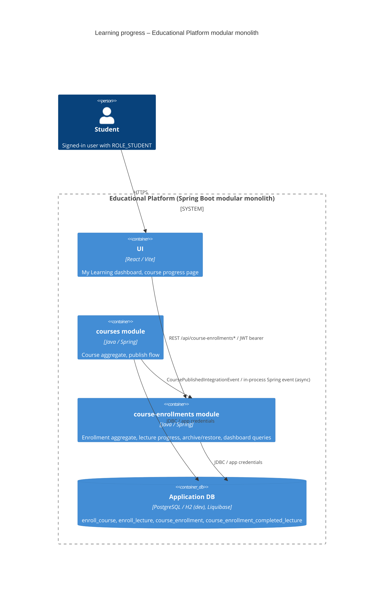

# 14. Learning progress tracked in the Course Enrollments bounded context

- **Status:** Proposed
- **Date:** 2026-10-06
- **ARB ticket:** TO BE CREATED
- **Authors:** Devin (AB-257)
- **Owning team:** Educational Platform (course-enrollments + courses modules)
- **Related ADRs:** 0001 (bounded contexts communication), 0002 (integration events), 0003 (CQRS), 0005 (identifiers between modules)

## Context

AB-257 adds a student "My Learning" dashboard: per-enrollment progress (% of lectures completed, last activity),
marking lectures completed / not completed, automatic completion of an enrollment, and archive / restore.
Today the `course-enrollments` module only knows a course UUID and a completion flag; the curriculum lives in
the `courses` module. Progress is business data that must be persisted per student and per lecture, and the
enrollments module must know which lectures exist without reaching into the courses tables (ADR 0001/0005).

ARB triggers: T4 (new async integration event `CoursePublishedIntegrationEvent` between the `courses` and
`course-enrollments` bounded contexts; the `GET /course-enrollments` response changes from a list to a page).
T2 is **not** triggered: the new tables live in the existing application database, hold no new data
classification (learning progress, same owner as existing enrollment data). No new deployable, vendor,
auth boundary, runtime or infra change (T1, T3, T5–T9 not triggered).

## Decision

We will keep learning progress inside the `course-enrollments` bounded context. The `courses` module publishes a
`CoursePublishedIntegrationEvent` (course UUID, name, ordered lecture UUIDs/titles) whenever a course is published;
`course-enrollments` replicates that snapshot into `enroll_course` / `enroll_lecture` and stores per-enrollment
completed lecture UUIDs in `course_enrollment_completed_lecture`. Completion, archive and timestamps are
attributes of the `CourseEnrollment` aggregate; the dashboard is served by paginated, student-scoped queries and
all mutations go through `@PreAuthorize("hasRole('STUDENT')")` command handlers. The integration event uses the
existing in-process Spring `ApplicationEventPublisher` / `@EventListener` mechanism (ADR 0002).

## Alternatives considered

| Alternative | Pros | Cons | Why rejected |
| --- | --- | --- | --- |
| Do nothing | No change | Ticket cannot be delivered; students have no progress view | Does not meet AB-257 |
| Query the `courses` module (repository / REST) from `course-enrollments` for the curriculum on every request | No replication, always fresh | Violates ADR 0001/0005 (no cross-module repository access), couples contexts, slower dashboard | Breaks the modular-monolith rules enforced by `LayerTest` |
| Store progress in the `courses` module (per student completed lectures on `Course`) | Curriculum already there | Mixes student state into the course catalogue aggregate; the courses context has no notion of students | Wrong aggregate ownership |
| Client-side (local storage) progress | Zero backend change | Not persisted across sessions/devices — fails acceptance criteria | Rejected by requirements |

## Architecture

## Non-functional requirements

| NFR | Target | How met |
| --- | --- | --- |
| Availability SLO | Same as the monolith (TBD — owner to confirm before ARB) | No new deployable |
| p95 latency | Dashboard page < 300 ms for students with hundreds of enrollments (TBD — owner to confirm) | Spring Data pagination (max page size 50), `@EntityGraph` on course, status counts via `count` queries |
| RPO / RTO | Inherits application database | Same database, Liquibase changesets are additive |
| Peak load | TBD — owner to confirm before ARB | Read-mostly; each lecture toggle is one small transaction |
| Scaling model | Same as monolith | Stateless handlers |
| Data retention | Progress kept for the life of the enrollment | Archive hides, never deletes |

## Security & compliance

- **Data classification:** Internal — learning progress tied to a username (no new PII; username already stored).
- **Encryption at rest:** Inherits application database configuration (unchanged).
- **Encryption in transit:** HTTPS at the edge (unchanged); in-process event, no network hop.
- **AuthN / AuthZ:** Existing JWT; all new endpoints require `ROLE_STUDENT` and are scoped to the current student (`findByUuidAndStudent`), so a student cannot read or mutate another student's enrollment.
- **Secrets:** none added.
- **Audit logging:** Timestamps `enrolled_at`, `last_activity_at`, `completed_at`, `archived_at` on the enrollment; no separate audit trail (follow-up if required).
- **Data residency / regions:** unchanged.
- **Policy sections satisfied:** no infrastructure change.
- **Threats considered:** IDOR on enrollment / lecture UUIDs (mitigated by student scoping), progress updates on archived enrollments (rejected with 422), replay of course publish (idempotent refresh keyed by lecture UUID).

## Cost

| Item | Assumption | Monthly estimate |
| --- | --- | --- |
| Database storage | one row per completed lecture per enrollment (two ints/uuid) | negligible (< $1) |
| **Total** | | ~ $0 — below ARB_LIGHT threshold |

## Operations

- **On-call rotation:** existing platform rotation (TBD — owner to confirm).
- **Runbook:** N/A — no new runtime component; Liquibase changesets `2026_10_06-1..4` in `course-enrollments.yml`.
- **Dashboards / alarms:** existing application metrics.
- **Rollback plan:** revert the PR; changesets are additive (new nullable columns / new tables) so the previous version still runs against the migrated schema.
- **Migration / cut-over plan:** The changesets are additive and were verified to apply on an empty database. Note that in the current Boot 4 build the Liquibase auto-configuration is not active (only `liquibase-core` is on the classpath) and the schema is created by Hibernate DDL; enabling Liquibase is a separate follow-up because the existing changelog has drifted from the entities. Courses published before this change have no replicated lectures until re-published; a one-off republish (or backfill script) is a follow-up.

## Policy exceptions requested

| Rule | Resource | Justification | Compensating control | Expiry |
| --- | --- | --- | --- | --- |
| none | | | | |

## Consequences

- Positive: enrollments context owns student learning state end-to-end; dashboard is paginated and student-scoped; courses context stays free of student state.
- Negative / risks: curriculum snapshot in `course-enrollments` can lag behind `courses` until the next publish; replication is async, so a course published and enrolled within milliseconds could briefly show 0 lectures.
- Follow-ups: backfill lectures for already-published courses; emit the event from `CurriculumItem` updates if courses become editable after publishing.

## Open questions

- Availability / latency / peak-load targets to be confirmed by the owning team before ARB.
- Should quizzes count towards progress (currently only lectures do)?
